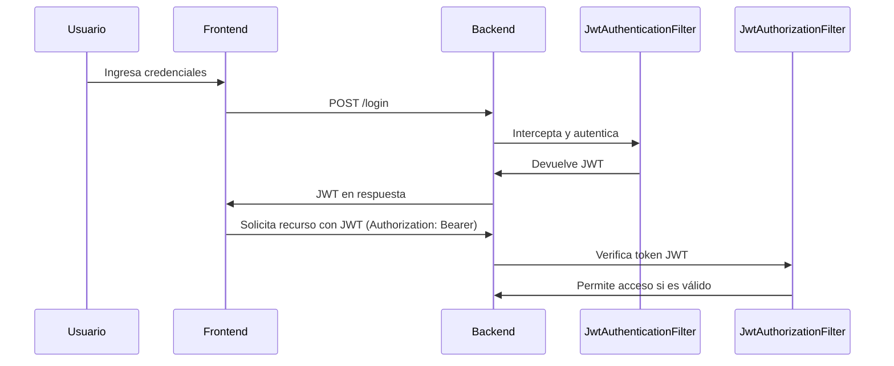

# Proyecto Spring Boot + Spring Security + JWT

Este proyecto es una aplicación de ejemplo que utiliza **Spring Boot** con **Spring Security** para implementar autenticación y autorización mediante **JWT (JSON Web Tokens)**. A continuación se detalla el funcionamiento interno del sistema de seguridad, incluyendo filtros, utilidades y configuraciones.

---

## 🌐 Tecnologías Utilizadas

* Java 17+
* Spring Boot
* Spring Security
* JWT (io.jsonwebtoken)
* Maven / Gradle

---

## 🔐 JWT: Autenticación y Autorización

Este proyecto se basa en un flujo JWT como el siguiente:

```
[ Cliente ] --(credenciales)--> [ JwtAuthenticationFilter ] --> [ SecurityContext ]
                                          |
                                          v
                                     [ JwtUtils genera JWT ]
                                          |
                                          v
[ Cliente ] <--(JWT Token)-- [ Backend ]

[ Cliente ] --(JWT Token)--> [ JwtAuthorizationFilter ] --> [ Seguridad Verificada ]
```

---

## 📋 Detalle de Clases Clave

### 1. `JwtAuthenticationFilter`

Clase que intercepta las solicitudes de login (`/login`).

**Objetivo:**

* Procesar las credenciales de acceso (usuario y contraseña).
* Validarlas mediante el `AuthenticationManager`.
* Si son válidas, generar un JWT mediante `JwtUtils` y enviarlo como respuesta.

**Métodos principales:**

* `attemptAuthentication`: Extrae credenciales y autentica.
* `successfulAuthentication`: Genera y adjunta el token JWT.

**Diagrama simplificado:**

```
[POST /login]
     |
     v
[ JwtAuthenticationFilter ]
     |
     v
[ AuthenticationManager ]
     |
     v
[ JwtUtils --> genera Token ]
     |
     v
[ Respuesta con Token ]
```

---

### 2. `JwtAuthorizationFilter`

Este filtro intercepta **todas las peticiones** excepto las de autenticación. Se encarga de verificar que el token JWT sea válido.

**Objetivo:**

* Leer el token JWT desde la cabecera `Authorization`.
* Validarlo mediante `JwtUtils`.
* Si es válido, insertar el `UsernamePasswordAuthenticationToken` en el `SecurityContext`.

**Métodos principales:**

* `doFilterInternal`: Revisa si el token es válido y autentica el contexto.

**Diagrama simplificado:**

```
[ Cualquier petición con Token JWT ]
           |
           v
 [ JwtAuthorizationFilter ]
           |
           v
 [ JwtUtils valida Token ]
           |
           v
 [ SecurityContext actualizado ]
```

---

### 3. `JwtUtils`

Clase utilitaria para manejo de JWTs.

**Responsabilidades:**

* Generar tokens con información del usuario.
* Validar tokens.
* Extraer claims como nombre de usuario y roles.

**Métodos destacados:**

* `generateAccessToken(UserDetails user)`: crea el JWT.
* `getUsernameFromToken(String token)`: extrae el username.
* `isTokenValid(String token, UserDetails user)`: valida exp y user.

**Diagrama simplificado:**

```
        [ JwtUtils ]
         /      \
        v        v
 [ Generar ]   [ Validar ]
 [  Token  ]   [  Token  ]
```

---

## 🚀 `SecurityConfig.java`: Clase de Configuración de Seguridad

Esta clase define cómo se comporta Spring Security dentro de la aplicación.

### Beans y Flujo de Configuración

```mermaid
flowchart TD
    A[SecurityFilterChain] --> B[HttpSecurity config]
    B --> C[/login permisivo]
    B --> D[anyRequest autenticado]
    B --> E[session STATELESS]
    B --> F[addFilter JwtAuthenticationFilter]
    B --> G[addFilter JwtAuthorizationFilter]

    H[AuthenticationManager] --> I[Autenticación personalizada]
    J[PasswordEncoder] --> K[BCryptPasswordEncoder()]
```

### Detalle de Beans

| Bean                    | Descripción                                                     |
| ----------------------- | --------------------------------------------------------------- |
| `SecurityFilterChain`   | Configura las rutas seguras y agrega los filtros JWT.           |
| `AuthenticationManager` | Se usa en el filtro de autenticación para validar credenciales. |
| `PasswordEncoder`       | Codifica las contraseñas con BCrypt.                            |

**Diagrama resumido de flujo de filtros:**

```
 [Http Request]
      |
      v
[ JwtAuthorizationFilter ]
      |
      v
[ Ruta protegida? ] -- No --> Permitir
      |
     Sí
      |
[ Token válido? ] -- No --> Error 403
      |
     Sí
      |
[ SecurityContext autorizado ]
```

---

## 🪧 Flujo General de Seguridad en el Proyecto



---

## 📚 Resumen

| Componente                | Rol                                           |
| ------------------------- | --------------------------------------------- |
| `JwtAuthenticationFilter` | Procesa inicio de sesión y genera JWT.        |
| `JwtAuthorizationFilter`  | Verifica JWT en cada petición protegida.      |
| `JwtUtils`                | Genera, valida y analiza tokens JWT.          |
| `SecurityConfig`          | Configura Spring Security y registra filtros. |

---

## 📦 Instalación y Ejecución

1. Clona el repositorio

   ```bash
   git clone https://github.com/tu-usuario/tu-repo.git
   ```
2. Construye el proyecto

   ```bash
   ./mvnw clean install
   ```
3. Ejecuta la aplicación

   ```bash
   ./mvnw spring-boot:run
   ```

---

## 📚 Referencias

* [Documentación oficial de Spring Security](https://docs.spring.io/spring-security/reference/index.html)
* [JWT.io](https://jwt.io)

---

> Este README está diseñado para que desarrolladores puedan entender rápidamente el funcionamiento del sistema de seguridad basado en JWT con Spring Boot. Sientete libre de adaptarlo o extenderlo para tu caso particular.
